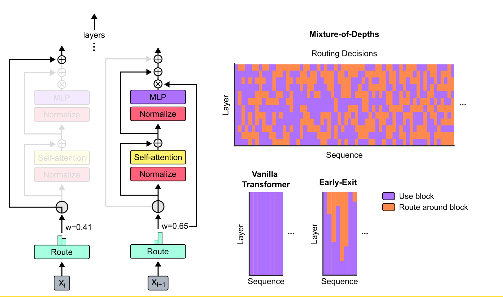
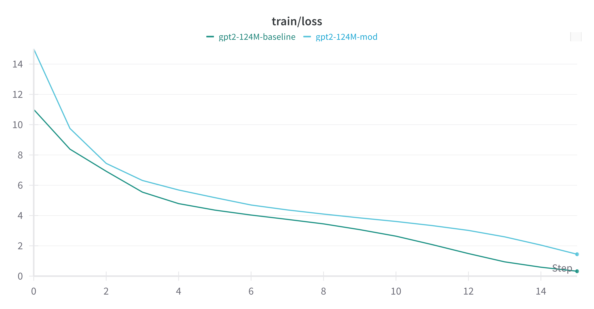

# nanoMoD

This is an attempt to reproduce the `Mixture-of-Depths` strategy to dynamically allocate compute when training LLMs introduced at the [Mixture-of-Depths: Dynamically allocating compute in transformer-based language models](https://arxiv.org/abs/2404.02258) paper based on [Karpathy nanoGPT](https://github.com/karpathy/nanoGPT/tree/master).




## Paper TL;DR

Not all tokens and sequences require the same time or effort to accurately make a prediction. With that in mind `Mixture-of-Depths` try to save compute by reducing the sequence length that is processed by a transformer block (a block is the pass through attention and MLP see image above) using a router (simple linear layer akin to `Mixture-of-Experts` gate) to learn which tokens should go through the compute path or route across the block. Furthermore, the introduction of a `capacity` term (amount of tokens processed) allows user to set the amount of compute that will be saved.


## Implementation Details

As mentioned previously, this work builds up on [Karpathy nanoGPT](https://github.com/karpathy/nanoGPT/tree/master) and to make it `Mixture-of-Depth` compatible some modifications had to be made:

1. Introduce `MoDBlock` class
2. Add `capacity_ratio` and `use_mod` to `GPTConfig`
3. Add router `aux_loss`


Implementation itsefl is not hard what makes things a bit harder is that authors are not super clear in how they actually implemented things and no code was official code was released.


### Introduce `MoDBlock`

`MoDBlock` has basically the same `forward` signature as in `Block` with the addition of a `router` layer (simple linear layer) and a `topk` logic. The added logic is as follows:

```python
# Compute router logits and weights
router_logits = self.router(x)
router_logits = router_logits.squeeze(-1) # (batch_size, seq_len)
# Applying softmax to all tokens as in paper it was mentioned that topk is same as in ColT5
router_weights = F.softmax(router_logits, dim=-1)

# Select compute tokens
_, selected_indices = torch.topk(router_weights, self.capacity, dim=-1, sorted=True)
# Sort indices so we keep causal sequence
selected_indices, _ = torch.sort(selected_indices, dim=-1) # (batch_size, capacity)
# Get the weights associated with tokens that will be computed
selected_weights = torch.gather(router_weights, 1, selected_indices) # (batch_size, capacity)
# Get the tokens that will be computed
compute_tokens = torch.gather(x, 1, selected_indices.unsqueeze(-1).repeat(1, 1, emb_dim)) # (batch_size, capacity, emb_dim)
```

The paper wasn't super clear as how it performed the logic, if it used only the logits to get the `topk`, if `softmax` was applied on the logits of all tokens or only the selected one, but given the commented in `2. Background` saying `"Like MoD, CoLT5 uses soft top-k for making routing decisions."` and other hints like the images on the paper the final logic seems reasonable.

### Add `capacity_ratio` and `use_mod`

Just added `capacity_ratio` and `use_mod` to `GPTConfig`. The former represents the ratio of the orignal sequence length that is routed to the compute path and the latter is used for flexibility to be able to create `MoD` or `Baseline` variants from the same model class.

In the `GPT` class when using `use_mod=True` we add `MoDBlock` to every other layer starting with the normal `Block` class as in the paper this is said to give better results.

### Add router `aux_loss`

In section `3.5 Sampling` authors mention two ways to fix the problem that `topk` is a `non-causal` operation. First option is to add an auxiliary loss and the second option is to add an auxiliary classifier and in the paper, it's shown that both strategies result in similar performance. Since the authors didn't give much explanation on how the auxiliary classifier should look like the auxiliary loss was implemented. This is what is mentioned about this auxiliary loss in the paper:

```
We use a binary cross-entropy loss wherein the router’s outputs provide the logits, and the top-𝑘 selections of these logits provide the targets (i.e. 1 if a token was among the top-𝑘, and 0 if not). Intuitively, this loss centers the sigmoid of the router’s outputs around 0.5; those tokens that are selected among the top-k are pressured to produce router outputs above 0.5, and those not among the top-k will be pressured to produce router outputs below 0.5.
```


## Pros & Cons

Pros:
- For the same parameter count it uses less compute than same model without `MoD`
- Faster forward pass for same parameter count
- According to authors isoFlop optimals perform better in the case of Vanilla Transformer
- Since less compute is used one can increase model
- It's a tool that can be expanded to different conditional compute strategies (decouple `query`, `key`, `value` or as authors said `long-term memory` a sort of smart `KV-cache`)
- Can be combined with other techniques such as `MoE`


Cons:
- It's not plug and play i.e. a router has to be trained to learn how to route tokens
- Capacity is something that needs to be tune and though authors mentioned that `"we found that aggressive capacity reduction was best..."` for Vanilla Transformer it's not clear if the same is valid for other models, thus need for experimentation.
- As authors mentioned `"Learned routing mechanisms are sometimes non-causal..."` and even that their strategies to mitigate this problem were shown to be effective this is another point that should be checked.


## Results

For the reproduction two `GPT2` models (124M parameters version) were trained with and without `MoD` on the `Shakespeare` dataset found in the `data` directory. You can see the full training logs [here](https://wandb.ai/eduardopacheco/mod-gpt-shakespeare?nw=nwusereduardopacheco), below is the training loss curve.




The running configs were the same the only difference was the presence of `MoD`. Both models were trained for 750 iterations (`MoD` model took 21 minutes and `Baseline` took 24 minutes on 4x RTX 3090). 


## Future

One question that still remains unanswered is how well `MoD` works for pre-trained models. Experiments such as freezing the pre-trained models weights and just training the `router` layer with different `capacity`s and evaluating the model performance on different benchmarks to check if quality is inference quality is still retained.
